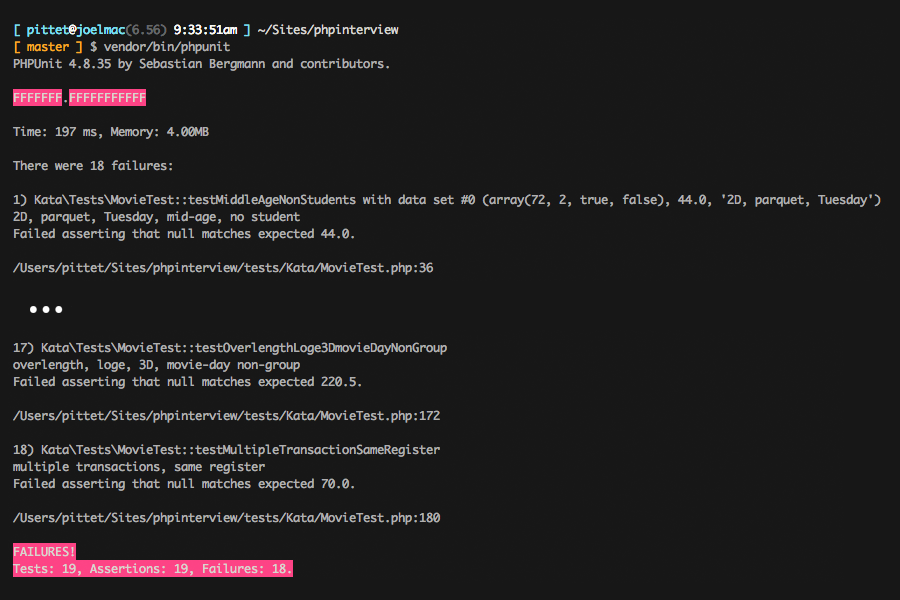

## PHP Interview Kata

*Code Kata* is a term coined by Dave Thomas, co-author of the book
The Pragmatic Programmer, in a bow to the Japanese concept of *kata*
in martial arts. A code kata is an exercise in programming which
helps a programmer hone their skills through practice and repetition.
As of October 2011, Dave Thomas has published 21 different katas.

You can find others to start practicing [here](http://codingdojo.org/KataCatalogue/).

When you do programming katas, you use TDD. That's why I have included
PHPUnit as composer dependencies.

## Exercise: Movie Tickets

Adaptation of codingkata.org's Movie Ticket problem

### Description

The computers - if you can call those DOS slaves so - all went down. Worst case
scenario. As you are the only clerk who can multiply you are now in charge of
handling all ticket sales! Seize the opportunity!

**Basic admission rates (regular weekday, 2D movie, <=120 min, parquet)**

    General admission                               $11.00
    Students                                        $8.00
    Senior Citizens (65 & older)                    $6.00
    Children (under 13)                             $5.50
    Group (20 people or more)                       $6.00 each

**Exceptions**

    3D movie                                        +$3.00
    Over-length (more than 120 min.)                +$1.50
    Movie Day (Thurdsday, except for groups!)       -$2.00
    Weekends                                        +$1.50
    Loge                                            +$2.00

Customer satisfaction is important, so always charge the lowest price  possible!

To solve this exercise, implement the interface provided within
`src/Kata/Movie.php` after you checked out the project code.

### Execute tests

1. You will need composer.

       curl -sS https://getcomposer.org/installer | php

1. Then add your code to 'src/Kata/Movie.php' until tests pass, using pricing
   rules from above exercise notes.

1. Run './vendor/bin/phpunit' to run your tests.

       ./vendor/bin/phpunit

1. To start it should look like this

    

1. And to finish it will look like this:

    
